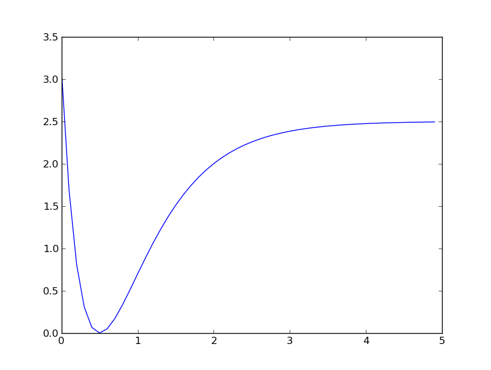

# Introduction to scipy

## Olav Vahtras

Computational Python

---

layout: false

## SciPy

* Collection of scientific libraries in different disciplines
* http://www.scipy.org
* http://www.scipy-lectures.org

---

### Optimization

* minimizing
* curve fitting
* least-square

### Integration
---

### Minimizing



```
    import math
    def f(r):
       d=2.5; a=1.5; r0=0.5
       e=math.exp(-a*(r-r0))
       return d*(1-e)**2
```

---

### The Brent method

* Bracketing approach
* No derivatives


    >>> minx = optimize.brent(f)
    >>> print minx, f(minx)
    0.500000001794 1.81016124365e-17

---

### Conjugent gradient


* Gradient function can be given
* Approximate gradient used if not


```
    >>> minx = optimize.fmin_cg(f, [1])
    Optimization terminated successfully.
             Current function value: 0.000000
             Iterations: 3
             Function evaluations: 21
             Gradient evaluations: 7
    >>> print minx, f(minx)
    [ 0.50000005] 1.39392421709e-14
```
--

### Supply gradient

```
    >>> def g(r):
    ...   d=2.5; a=1.5; r0=0.5
    ...   e=math.exp(-a*(r-r0))
    >>> minx = optimize.fmin_cg(f, [1], fprime=g)
    >>> print minx, f(minx)
    Optimization terminated successfully.
             Current function value: 0.000000
             Iterations: 3
             Function evaluations: 7
             Gradient evaluations: 7
    [ 0.50000005] 1.68621264068e-14
```
    
---


### The Newton method

* Based on a local second-order expansion
$$
    f(x) = f(x_0) + (x-x_0)f'(x_0) + \frac 1 2 (x-x_0)f''(x_0)
$$

* Minimized by
$$
    f'(x) = f'(x_0) + (x-x_0)f''(x_0) = 0
$$

* Iterative method
$$
    x = x_0 - f'(x_0)/f''(x_0)
$$

---

### using the Newton method

* Hessian is optional - requires more gradient evaluations
```
    >>> minx = optimize.fmin_ncg(f, [1], fprime=g)
    >>> print minx, f(minx)
    Optimization terminated successfully.
             Current function value: 0.000000
             Iterations: 6
             Function evaluations: 11
             Gradient evaluations: 18
             Hessian evaluations: 0
    [ 0.5] 3.53519126782e-19
```    

---

### supply the Hessian

```
    >>> def h(r):
    >>>   d=2.5; a=1.5; r0=0.5
    >>>   e=math.exp(-a*(r-r0))
    >>>   return 2*a*d*(-a*e*(1-e) + e*(a*e))
    Optimization terminated successfully.
             Current function value: 0.000000
             Iterations: 6
             Function evaluations: 11
             Gradient evaluations: 6
             Hessian evaluations: 6
    [ 0.5] 1.49714017434e-23
```

---

### using quasi-Newton method

```
* some approximation of the Hessian is maintained
* when the Hessian is too expensive
```

```
    >>> minx = optimize.fmin_bfgs(f, [1], fprime=g)
    >>> print minx, f(minx)
    Optimization terminated successfully.
             Current function value: 0.000000
             Iterations: 3
             Function evaluations: 6
             Gradient evaluations: 6
    [ 0.49999989] 7.41660768733e-14
```

---

### using  lBFGS

* inprinciple as BFGS - does not store explicit Hessians


```
    >>> minx, fminx, dic = optimize.fmin_l_bfgs_b(f, [1], fprime=g)
    >>> print minx, f(minx)
    >>> for k in dic:
    ...    print k, dic[k]
    [ 0.5] 2.17833574202e-17
    warnflag 0
    task CONVERGENCE: NORM_OF_PROJECTED_GRADIENT_<=_PGTOL
    grad [ -2.21387792e-08]
    funcalls 9
```

---

### Curve-Fitting

* Consider the Morse example ``d=2.5, a=1.5 r0=0.5``
* Add numerical noise


```
    >>> x = numpy.arange(0, 5, .1)    
    >>> y = f(x) + 0.01*numpy.random.normal(len(x))
    >>> print optimize.curve_fit(f, x, y)
    (array([ 3.79505629,  0.37332076, -1.94009589]), array([[ 0.66594742, -0.15499145, -0.71700161],
           [-0.15499145,  0.03847578,  0.18918748],
           [-0.71700161,  0.18918748,  1.00385781]]))

```

---

* Lower the noise


```
    >>> x = numpy.arange(0, 5, .1)    
    >>> y = f(x) + 0.001*numpy.random.normal(len(x))
    >>> print optimize.curve_fit(f, x, y)
    (array([ 2.5468709 ,  1.51754354,  0.49529173]), array([[  1.66450955e-05,  -1.22341586e-05,   2.42381535e-06],
           [ -1.22341586e-05,   2.43545494e-05,  -5.59536473e-06],
           [  2.42381535e-06,  -5.59536473e-06,   1.89802521e-06]]))
```
---

### Least-Square methods


#### Example

Simple least square fitting to a straight line

* Initialize arrays

```
    >>> import numpy
    >>> from scipy.optimize import leastsq
    >>> x = numpy.arange(0, 10, .01)
    >>> k0 = 3.0
    >>> l0 = 1.0
    >>> y = k0 * x + l0 + numpy.random.randn(len(x))
```

---

* Define residual function
* The parameters to be optimize for the first tuple

```
    >>> def resid(p, y, x):
    ...    k,l = p
    ...    return y - k*x - l
```

---

* The arguments to ``leastsq`` are the residual function, the initial parameters ``p0`` and the data set ``(y, x)`` in ``args`` 


```
    >>> p0 = numpy.array([k0, l0])
    >>> plsq = leastsq(resid, p0, args=(y, x))
    >>> k, l = plsq[0]
    >>> print k, l
    k=3.008980 l=0.964311
```
---

### Integration

* uses package `scipy.integrate`
* definite integrals in 1-3 dimensions

---

#### Example


The integral

$$   \int_{-\infty}^\infty e^{-x^2} = \sqrt{\pi} $$


```
    >>> from scipy.integrate import quad
    >>> sqrtpi = math.sqrt(math.pi)
    >>> def e2(x):
    ...    return math.exp(-x*x)
    >>> res, err = quad(e2, -10, 10)
    >>> print res, sqrtpi, abs(res-sqrtpi)
    1.77245385091 1.77245385091 2.22044604925e-16
```

---

Other module in scipy

* Machine learning `scikit-learn`
* Image processing `scikit-image`
* Statistics
* Symbolic mathematics `sympy`
* 3D-plotting 
